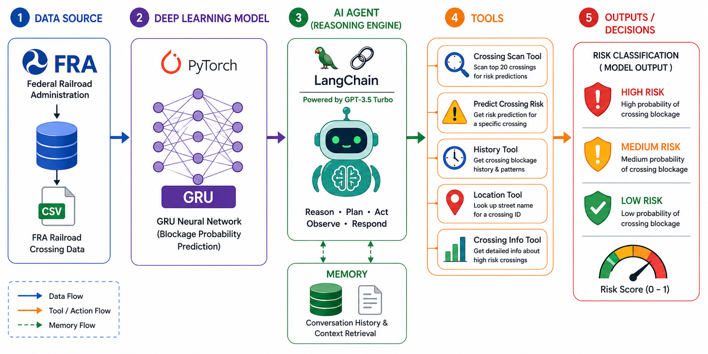

# Houston Railroad Crossing Blockage Prediction Agent 🚂 🛤️
### ITAI 2376 — Deep Learning in Artificial Intelligence | Houston City College


---

This project uses historical data from the Federal Railroad Administration (FRA) and a Gated Recurrent Unit (GRU) deep learning model to predict the probability that a railroad crossing in Houston, Texas will be blocked by a train, proactively alerting emergency dispatchers and city planners based on predicted risk level.

**Solo Project - Katherine Stanton**

## The Problem
The idea for this agent was inspired by living in the Houston, Texas neighborhood of Eastwood for nearly a decade. The neighborhood is defined by a high concentration of railroad crossings, where stopped trains regularly impede traffic for minutes to hours at a time. Beyond the inconvenience to drivers, the blocked crossings pose a significant public safety risk forcing first responders to seek detours and wasting critical response time in the process.

Since 2021, Texas has led the nation in blocked crossings according to publicly available data from the [FRA](https://www.fra.dot.gov/blockedcrossings/incidents). According to KHOU, in the first half of 2025, the Houston Fire Department was blocked 643 times with half of those calls resulting in delays ([KHOU, 2025](https://www.khou.com/article/news/local/houston-rail-crossings-blocked-by-stopped-trains/285-f59f3d0c-ef28-48fe-8658-790ee95fb748)). Between 2020 and 2026, Eastwood Street had the highest frequency of blockages with the FRA recording 2,277 reports with an increasing trend year over year.

Despite initiatives in recent years, including the City of Houston's [Smart Railroad Crossings](https://www.houstontx.gov/council/committees/tti/20220512/Smart-Railroad-Crossing-Monitors-Pilot.pdf) pilot program, a study by [TRAINFO](https://trainfo.ca/wp-content/uploads/47415-TR-Trainfo-White-Paper-FINAL-Web.pdf), and the launch of [Train Watch](https://houstontx.gov/trainwatch/) in 2025, no publicly available tool proactively predicts when a crossing will be blocked and recommends a course of action before emergency vehicles are impacted. This agent seeks to fill that void using only publicly available FRA data, making it accessible without the need for proprietary hardware or paid APIs. It was built with the community of Houston in mind, to serve as a tool for emergency dispatchers to make informed decisions based on proactive alerts and for city planners who need pattern analysis data to justify infrastructure investment decisions.

## Option Chosen
**Option A** - the Single AI Agent was chosen for this project, the same plan as the Midterm blueprint. 

## Architecture Overview
This agent follows a structured  pipeline:

**Input Data → GRU Model → LangChain Agent → Tools → Decision**

It uses historical data from the FRA Blocked Crossings Portal [dataset](https://www.fra.dot.gov/blockedcrossings/incidents), filtered to Houston, Texas between January 1, 2020 and April 20, 2026, yielding 20,783 raw records. After preprocessing and cleaning, the dataset was reduced to 16,864 Union Pacific-exclusive records (accounting for 98.3% of the original dataset), which were then used to train the GRU deep learning model. The GRU model predicts blockage probability on a scale of 0 to 1, with 0 being a low probability and 1 being the highest probability. A risk classifier then applies static thresholds to assign LOW, MEDIUM, or HIGH risk to an event. LangChain's AgentExecutor, powered by GPT-3.5 Turbo, manages the ReAct reasoning loop which determines which tools to select and responds to user queries. Five tools were defined and registered for the LangChain agent: `gru_prediction_tool`, `crossing_info_tool`, `high_risk_crossings_tool`, `crossing_history_tool`, and `street_lookup_tool`, and session memory was retained via LangChain's `ConversationBufferMemory`. The agent synthesizes a natural language response based on the risk assessment. Emergency dispatchers receive proactive alerts, while city planners can query historical blockage patterns and crossing statistics to support infrastructure decisions.

### Architecture Diagram


## Frameworks and Tools

**Agent Framework**
- LangChain 0.2.16 — agent orchestration and tool management

**LLM Provider**
- OpenAI GPT-3.5 Turbo — powers the ReAct reasoning loop

**LangChain Components**
- AgentExecutor — manages the reasoning and tool-calling loop
- ReAct — reasoning pattern (Reason, Act, Observe, Respond)
- ConversationBufferMemory — retains session context
- Tool — wraps each function as a callable for the agent

**Deep Learning**
- PyTorch 2.3.0 — deep learning framework
- GRU Binary Classifier — predicts blockage probability (0.0 to 1.0)
- Scikit-learn — data preprocessing and model evaluation

**Data Processing**
- Pandas — data loading, cleaning, and feature engineering
- NumPy — numerical operations and array handling

**Data Source**
- [FRA Blocked Crossings Portal](https://www.fra.dot.gov/blockedcrossings/incidents) — 20,783 raw Houston crossing records (2020–2026)

**Development Environment**
- Google Colab — GPU-accelerated notebook environment
- Python 3.12

## Installation Instructions

### Prerequisites
- Python 3.12
- A [Google Colab](https://colab.research.google.com) account (recommended) or local Jupyter environment
- An OpenAI API key — get one at [platform.openai.com](https://platform.openai.com/api-keys)

### Steps

**1. Clone the repository**
```bash
git clone https://github.com/ktgraze/KatherineStanton_Solo_ITAI2376.git
cd KatherineStanton_Solo_ITAI2376
```

**2. Install dependencies**
```bash
pip install -r requirements.txt
```

**3. Set up environment variables**

Copy the provided template and add your API key:
```bash
cp .env.example .env
```
Open `.env` and fill in your key:
```
OPENAI_API_KEY=your-openai-api-key-here
```

**4. Enable GPU runtime (Google Colab)**

If running in Google Colab:
- Go to **Runtime → Change runtime type**
- Set Hardware accelerator to **T4 GPU**
- Click **Save**

**5. Mount Google Drive (Google Colab)**

Run the first cell in `agent.ipynb` to mount your Google Drive. This is required to access the dataset and saved model files.

### Notes
- The httpx proxy patch in Section 1 of the notebook is required for Colab compatibility and runs automatically
- All API keys are loaded from Colab Secrets or a `.env` file — never hardcoded
- If you encounter dependency conflicts, ensure you are using the pinned versions in `requirements.txt`

## How to run

### Option 1 — Google Colab (recommended)

1. Open [agent.ipynb](agent.ipynb) in Google Colab
2. Enable GPU runtime — **Runtime → Change runtime type → T4 GPU**
3. Run all cells from top to bottom in order
4. Navigate to **Section 7 — Demo Scenarios** to interact with the agent
5. To run your own queries, add a new cell and use:
```python
memory.clear()
response = agent_executor.invoke({
    "input": "Your question here"
})
print(response['output'])
```

### Option 2 — Local Jupyter

1. Ensure all dependencies are installed via `pip install -r requirements.txt`
2. Launch Jupyter:
```bash
jupyter notebook agent.ipynb
```
3. Run all cells from top to bottom in order
4. Note: the httpx proxy patch in Section 1 is Colab-specific and can be removed when running locally

### Important
- All cells must be run in order — later sections depend on variables defined in earlier ones
- The OpenAI API key must be configured before running Section 6
- In Google Colab, add your API key via **Secrets** (key icon in left sidebar) as `OPENAI_API_KEY`

## Example usage

The agent accepts natural language queries and uses the ReAct reasoning loop
to select the appropriate tools and return a risk assessment.
To run your own query, see the [How to run](#how-to-run) section above.

---

### Example 1 — Emergency dispatch query

**Input:**
```python
response = agent_executor.invoke({
    "input": "I need to route an ambulance through Leeland Street "
             "at 6pm on a Friday in March. "
             "Check the most heavily blocked crossing on that street "
             "and tell me if it is safe."
})
```

**Output:**
> The most heavily blocked crossing on Leeland Street (Crossing ID: 288224V)
> is not safe for the ambulance to pass through at 6pm on a Friday in March
> due to a high blockage risk of 94.0%. Immediate alert and rerouting are advised.

---

### Example 2 — Multi-crossing risk scan

**Input:**
```python
response = agent_executor.invoke({
    "input": "It is 8am on a Monday morning in April. "
             "I am a fire station commander in Houston's East End. "
             "Which railroad crossings are currently high risk "
             "and could delay my emergency vehicles today?"
})
```

**Output:**
> The high-risk crossing at 8:00 on Monday is Eastwood Street
> (ID: 859522Y) with a 100% blockage risk.

---

### Example 3 — City planner infrastructure analysis

**Input:**
```python
response = agent_executor.invoke({
    "input": "I am a Houston city transportation planner. "
             "I need to justify an infrastructure investment "
             "at Eastwood Street crossing 859522Y. "
             "Can you give me the historical blockage patterns "
             "and overall crossing information to support "
             "a grade separation project proposal?"
})
```

**Output:**
> The Eastwood Street crossing 859522Y has a high number of blockage
> reports with an increasing trend, particularly during rush hour and
> weekends. The average blockage duration is 56 minutes, with the most
> common duration being 16-30 minutes. The peak blockage hours are at
> 7:00, 12:00, and 2:00. This data supports the need for a grade
> separation project at this crossing to improve traffic flow and safety.

---

*Note: The agent's verbose reasoning chain (Thought → Action → Observation)
is visible in the notebook output. Screenshots of full reasoning chains
are available in the [demo video](#demo).*

## Known Limitations
- **No live train data**: Companies like Union Pacific and BNSF do not have publicly available APIs, so live train tracking is not possible. The agent predicts blockages from historical patterns only.
- **TranStar unavailable**: The TranStar live traffic API returned a 403 message from Colab's environment, so no live traffic information is available.
- **Session-only memory**: ConversationBufferMemory only stores queries and outputs during a session and does not save conversation history beyond a single session at this time.
- **No duration prediction**: The initial GRU model attempted to predict blockage duration but performed poorly (R<sup>2</sup> =0.046) and a pivot to binary classification was made.
- **No RL routing layer**: After feedback on the midterm blueprint, the reinforcement learning routing layer for emergency vehicle rerouting was scrapped.
- **Train Watch API unconfirmed**: Train Watch is built on Esri but no public API endpoint could be found.
- **Historical patterns only**: May not capture real-time conditions or accurately predict blockage probability for rare events. 

## Demo

A walkthrough of the agent handling three real-world scenarios —
emergency dispatch, multi-crossing risk scan, and city planner
infrastructure analysis.

📽️ [Watch the demo video](your-video-link-here)

The demo covers:
- Scenario 1 — Emergency dispatch query (Leeland Street, 6pm Friday)
- Scenario 2 — Multi-crossing risk scan (Monday 8am, East End)
- Scenario 3 — City planner infrastructure analysis (Eastwood Street)
